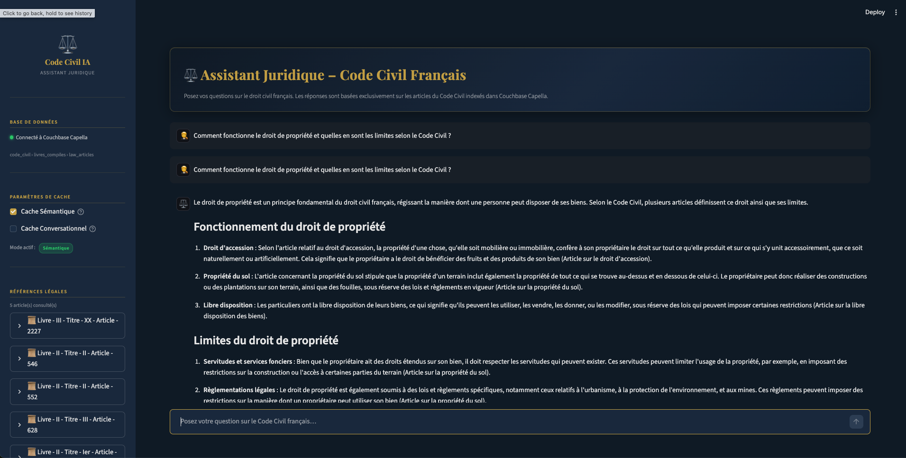

# ⚖️ AI Legal Assistant — French Civil Code

A professional RAG (Retrieval-Augmented Generation) assistant designed to query the French Civil Code with legal precision, powered by **LangGraph**, **Couchbase Capella**, and **OpenAI**.



## 📖 About the Project
This application transforms the French Civil Code into an interactive knowledge base. Unlike a standard LLM chat, this assistant bases its responses exclusively on real articles from the Civil Code, retrieved in real-time via vector search in Couchbase.

## 🗂️ Data Source
The legal data used in this project is sourced from the excellent work of **Steeve Morin**, available at [github.com/steeve/france.code-civil](https://github.com/steeve/france.code-civil). This repository provides a clean, machine-readable version of the French Civil Code, which we have processed and indexed for semantic search.

## 🚀 Key Features
- **Intelligent Workflow (LangGraph)**: Uses a state graph to orchestrate search, quality checks (relevance grading), and response generation. If no relevant articles are found, the AI automatically triggers a polite "fallback" path.
- **Vector Search (Couchbase FTS)**: High-performance semantic search across Civil Code articles.
- **Dual Caching System**:
  - **💾 Semantic Cache**: Instantly retrieves answers for semantically similar questions (similarity threshold set to 0.85).
  - **💾 Conversational Cache**: Exact-match caching for repeated queries.
- **Professional UI (Streamlit)**: "Legal Dark" themed interface with real-time process tracking, performance indicators (⏱️), and detailed source citations.
- **Legal Transparency**: Every response explicitly cites its sources, with a dedicated sidebar panel showing the retrieved articles.

---

## 🛠️ Installation & Setup

### 1. Prerequisites
- Python 3.11+
- A **Couchbase Capella** (or Server) cluster with indexed Civil Code data.
- An **OpenAI** API key.

### 2. Installation
```bash
# Clone the repository and enter the directory
cd quick_rag_demo_code_civil

# Create virtual environment
python3 -m venv .venv
source .venv/bin/activate

# Install dependencies
pip install -r requirements.txt
```

### 3. Configuration (.env)
Copy `.env.template` to `.env` and fill in your credentials:
```ini
OPENAI_API_KEY=sk-...
COUCHBASE_CONNECTION_STRING=...
COUCHBASE_USERNAME=...
COUCHBASE_PASSWORD=...
```

### 4. Indexing (FTS)
Ensure you have created the FTS indexes in Capella using the JSON definitions provided in the `indexes/` folder:
- `law_articles_vector_index.json` (for retrieval)
- `semantic_cache_index.json` (for caching)

---

## 🖥️ Usage
Launch the application with Streamlit:
```bash
streamlit run app.py
```

## 🧠 Diagnostics & Monitoring
The application displays performance indicators at the bottom of each response:
- **💾 ✅ Cache**: Appears if the response was served instantly from memory.
- **🐟 LLM**: Appears if the LLM generated a fresh response (Dory mode).
- **⏱️ X.XXs**: Total processing time for the request.
